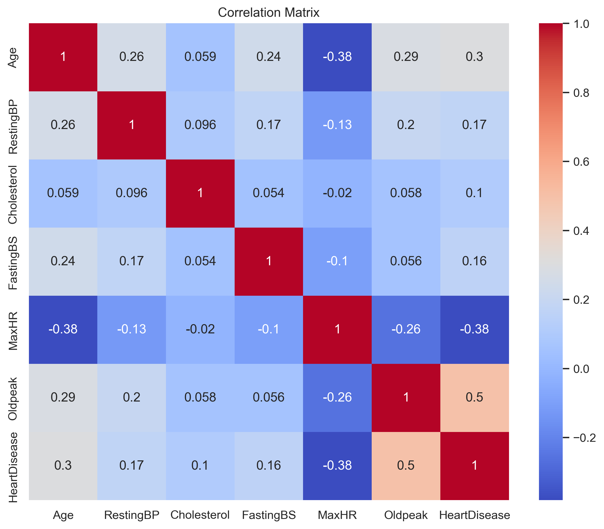
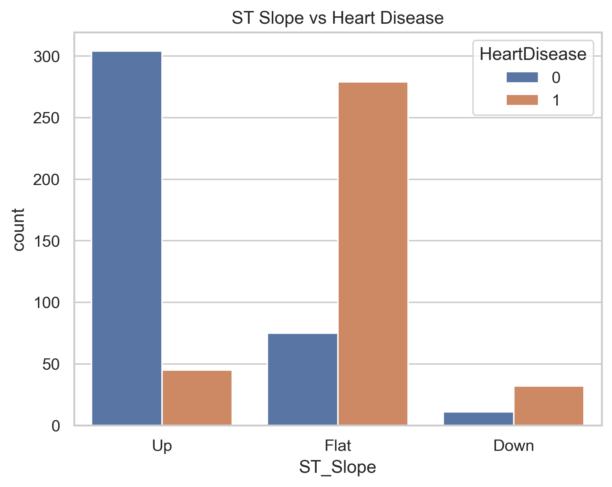
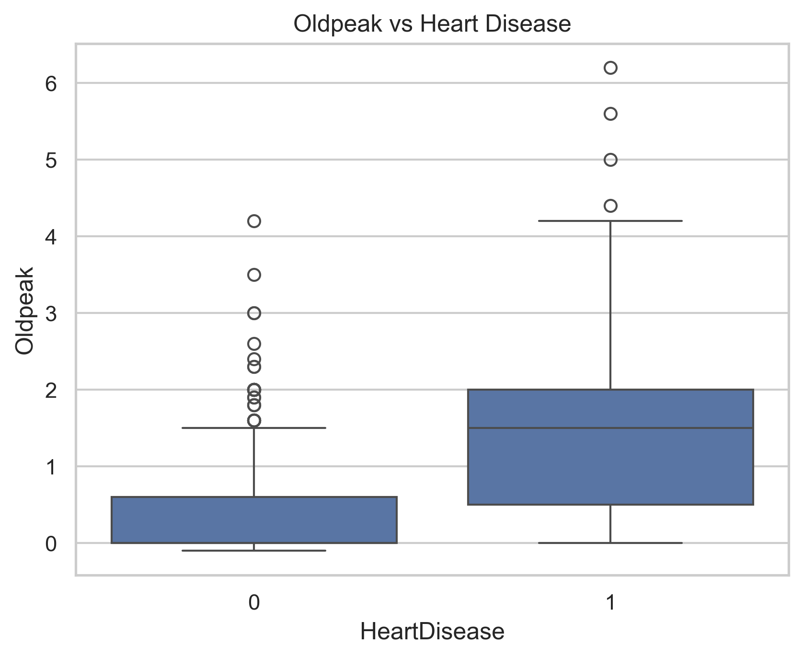
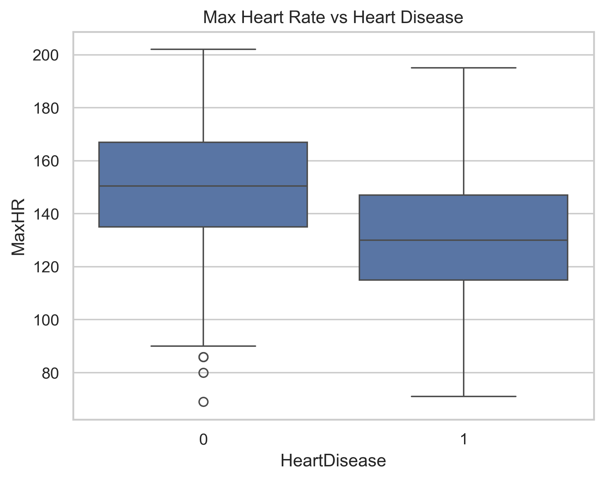

# Heart Disease Exploratory Data Analysis

## Overview
This project explores clinical risk factors associated with heart disease using exploratory data analysis. The goal is to identify patterns between patient characteristics and heart disease outcomes and highlight which variables may be most relevant for assessing risk.

This analysis focuses on understanding how different clinical indicators relate to heart disease and how these relationships can provide insight into early detection.

---

## Dataset
- Source: Kaggle Heart Disease Dataset  
- Observations: ~900 patients  
- Target Variable: HeartDisease (0 = No, 1 = Yes)  

### Features include:
- Age  
- Sex  
- Chest Pain Type  
- Resting Blood Pressure  
- Cholesterol  
- Max Heart Rate  
- Oldpeak (ST depression)  
- ST Slope  
- Exercise-Induced Angina  

---

## Key Questions
- Which variables are most associated with heart disease?  
- How do exercise-related features impact outcomes?  
- Which clinical indicators show the strongest relationships?  
- Are there patterns that distinguish higher risk patients from lower risk patients?  

---

## Key Insights
- ST Slope shows a strong relationship with heart disease, with flat and downward slopes linked to higher risk  
- Oldpeak has the strongest positive correlation with heart disease  
- Max heart rate is negatively associated with heart disease outcomes  
- Exercise-induced angina is associated with a higher likelihood of heart disease  
- Age shows a moderate positive relationship with heart disease risk  

---

## Visualizations

### Correlation Matrix
  
*Figure 1: Correlation matrix showing relationships between numerical variables and heart disease.*

---

### ST Slope vs Heart Disease
  
*Figure 2: Patients with flat or downward ST slopes show higher rates of heart disease.*

---

### Oldpeak vs Heart Disease
  
*Figure 3: Higher ST depression values are associated with increased heart disease risk.*

---

### Max Heart Rate vs Heart Disease
  
*Figure 4: Lower maximum heart rate is associated with a higher likelihood of heart disease.*

---

## Methods Used
- Exploratory Data Analysis  
- Data Visualization  
- Correlation Analysis  
- Categorical Feature Analysis  

---

## Tools and Technologies
- Python  
- Pandas  
- NumPy  
- Seaborn  
- Matplotlib  
- Jupyter Notebook  

---

## Project Structure
- `Data/` → dataset  
- `Images/` → saved visualizations  
- `Notebooks/` → full analysis notebook  
- `README.md` → project overview  

---

## How to Run
1. Clone the repository  
2. Open `Notebooks/heart_disease_eda.ipynb`  
3. Run all cells  

---

## Data Source
- Fedesoriano. (2021). *Heart Failure Prediction Dataset*  
  Available at: https://www.kaggle.com/fedesoriano/heart-failure-prediction  

---

## Future Improvements
- Apply machine learning models for prediction  
- Perform feature importance analysis  
- Explore class imbalance handling techniques  
- Evaluate model performance across different algorithms  

---

## Author
Vanessa Kramer
